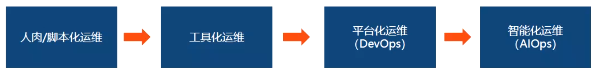
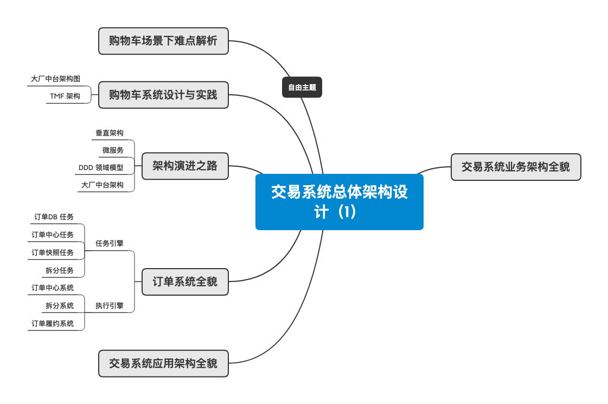

# naixue-p7-business-architect

## preview

### 业务架构师的“道”与“术”

### DDD

### 分布式多维架构

## IM系统分析与设计

## Docker

镜像是什么？

- 一个分层存储的文件，不是一个单一的文件
- 一个软件的环境
- 一个镜像可以创建N个容器
- 一种标准化的交付
- 一个不包含Linux内核而又精简的Linux操作系统

## 交易系统架构设计

